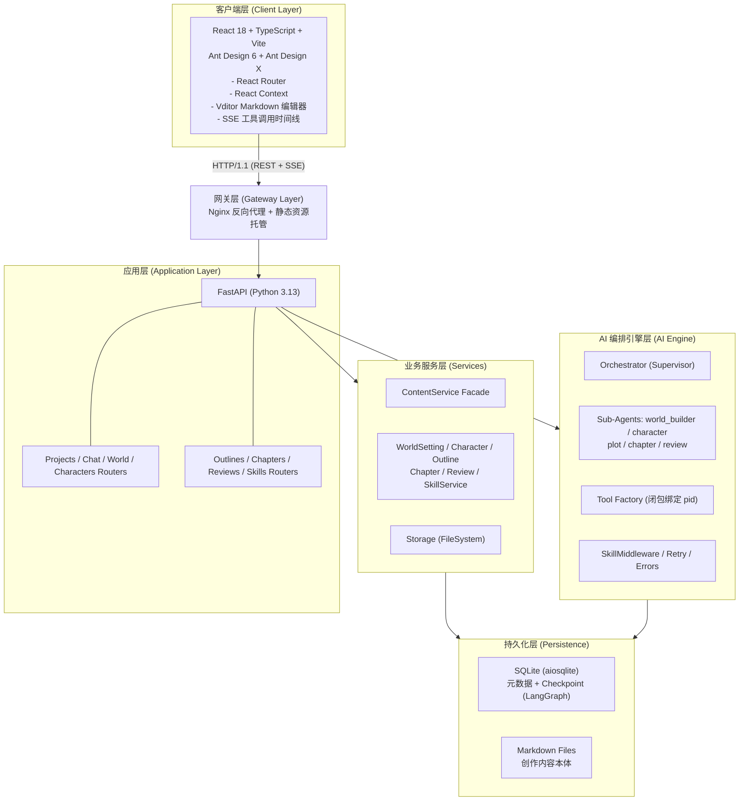
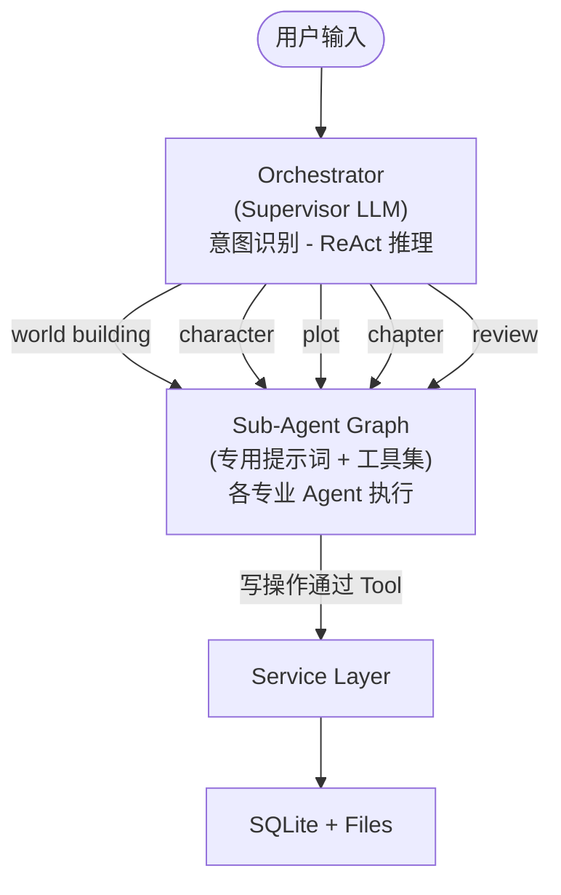
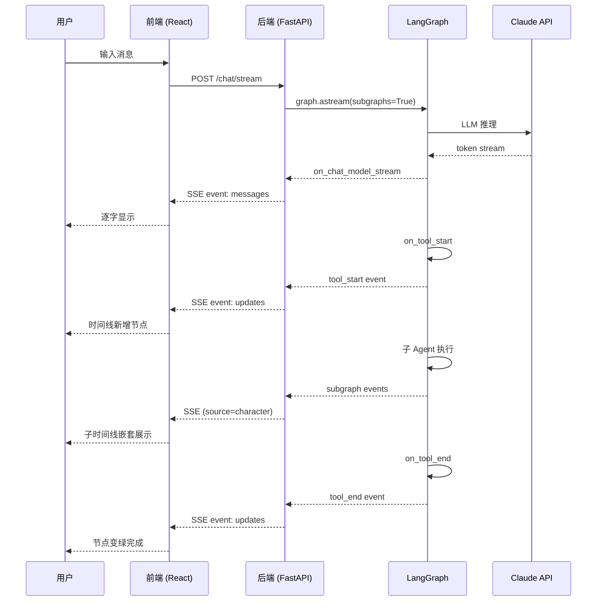

# PPT 内容资料包 — 砚台架构介绍

> **用途**：供演讲者直接填入 PowerPoint / Keynote / WPS 使用  
> **风格**：技术讲解风格，面向课程评审或技术答辩  
> **页数**：10 页核心页 + 附录参考  
> **说明**：本文件只提供内容和结构，不做视觉设计（配色、字体、动画由演讲者自行决定）

---

## PPT 风格指导（与前端界面保持一致）

前端界面采用 **"砚台丹青 · Inkstone & Vermillion"** 文人书房美学风格。PPT 设计建议与前端保持同一套视觉语言，形成品牌一致性。

### 色彩系统

| 色彩角色 | 色值 | 用途 |
|----------|------|------|
| **宣纸底色** | `#F5EFE3` | PPT 全局背景色，模拟 aged xuan paper |
| **卡片底色** | `#FBF6EA` | 内容卡片、信息框背景 |
| **浓墨文字** | `#1F1A17` | 主标题、正文文字 |
| **中墨文字** | `#4A3F33` | 副标题、次要说明文字 |
| **淡墨文字** | `#6E5F4F` / `#A89B85` | 辅助注释、时间戳、水印 |
| **朱砂主色** | `#C8323D` | 重点强调、按钮、图表高亮、 seal 印章风格标签 |
| **深朱砂** | `#9F2530` | hover 状态、激活状态 |
| **朱砂浅底** | `#F8E8E5` | 强调区块背景、选中项背景 |
| **竹青** | `#2E5A4D` | 成功/完成状态、正向指标 |
| **金箔** | `#B8924A` | 稀有强调、特殊标注 |
| **深木色** | `#3A2A1F` | 侧边栏/导航栏背景（如需深色区块） |
| **丝绢线** | `#C9B999` / `#E0D5C2` | 边框、分割线、表格线 |

### 字体系统

| 用途 | 推荐字体 | 备用字体 |
|------|----------|----------|
| **标题/Display** | 思源宋体 (Noto Serif SC) | 华文宋体、STSong、SimSun |
| **正文/Body** | 霞鹜文楷 (LXGW WenKai) | 思源宋体、Songti SC |
| **印章/Brush** | 马善政楷书 (Ma Shan Zheng) | 霞鹜文楷、Songti SC |
| **西文/拉丁** | Cormorant Garamond | EB Garamond、Georgia |
| **等宽/代码** | JetBrains Mono | Sarasa Mono SC、Menlo |

> 若演讲电脑未安装上述字体，统一回退到系统默认宋体/serif。避免使用黑体/无衬线体，以保持文人书房的调性。

### 布局与形态

- **圆角**：较小圆角，体现古典感 —— 小元素 2px，卡片 4px，大面板 8px
- **阴影**：纸张叠放感的柔和阴影，避免科技感过强的发光/渐变
  - 小阴影：`0 1px 2px rgba(31, 26, 23, 0.06)`
  - 中阴影：`0 2px 8px rgba(31, 26, 23, 0.10)`
  - 大阴影：`0 8px 24px rgba(31, 26, 23, 0.14)`
- **印章标签 (Seal Tag)**：朱砂底色 + 白色文字 + 极小圆角，用于状态标签、版本号、关键指标
- **分隔线**：使用 1px `#E0D5C2` 或 `#C9B999` 细线，不要用粗黑线

### 图表配色建议

- **主数据色**：`#C8323D`（朱砂）
- **次数据色**：`#2E5A4D`（竹青）
- **第三数据色**：`#B8924A`（金箔）
- **辅助/背景色**：`#F8E8E5`、`#E0EBE6`、`#F5ECD7`
- **网格线/轴线**：`#E0D5C2`

### 页面背景建议

1. **纯色方案**：全局 `#F5EFE3`，内容卡片 `#FBF6EA`
2. **纹理方案**：在 `#F5EFE3` 之上叠加极淡的纸张噪点纹理（opacity 3-5%），前端源码中已实现 SVG noise filter，可导出为透明 PNG 使用
3. **深色对比页**：如需强调某一页（如封面、过渡页），可用 `#3A2A1F` 深木色背景 + `#F5EFE3` 文字 + `#C8323D` 印章点缀

---

## 第 1 页：封面

### 页面标题
**砚台 — 基于多智能体协作的网络小说智能生成平台**

### 副标题
Agent 架构设计与实现

### 正文要点
- **项目定位**：面向中文网络文学的 AI 辅助创作平台
- **部署方式**：单机本地部署，数据完全本地存储（SQLite + Markdown 文件）
- **核心能力**：世界观构建 · 角色塑造 · 大纲设计 · 章节撰写 · 内容审阅
- **技术栈**：React 18 + TypeScript + FastAPI + LangChain/LangGraph + Anthropic Claude
- **Agent 规模**：1 Orchestrator（Supervisor）+ 5 专业子 Agent + 20+ 领域工具
- **答辩人**：（待填写）
- **日期**：（待填写）

### 演讲者备注
> 开场 30 秒，先给出项目定位和技术栈概览，让评审快速建立认知框架。强调三点：① 这不是 Chatbot 套壳，是多智能体工程化系统；② 单机部署，创作者数据完全本地存储；③ 技术选型面向"个人创作工具"场景，而非云服务。

---

## 第 2 页：课程需求对照

### 页面标题
**课程需求满足情况**

### 正文要点

| 课程需求 | 本项目实现 | 对应模块 |
|----------|-----------|----------|
| **① Agent 需展现规划和思考能力** | Orchestrator 基于 ReAct 框架，通过 LLM 推理自主识别用户意图，动态路由至 5 个专业子 Agent，非预定义 Workflow | `core/graph/builder.py` |
| **② Agent 具备与外部世界交互能力（≥2 个主题相关工具）** | 工具工厂提供 20+ 工具：世界观/角色/大纲/章节/审阅的增删改查 + 通用查询工具（query_content / get_content / get_outline_tree） | `core/agent/tool_factory.py` |
| **③ Agent 需具备自我修正能力** | 错误分类系统（AIError + 9 类 ErrorCode）→ 可重试错误自动指数退避重试（最多 3 次）→ 不可重试错误实时 SSE 推送 → 工具内异常捕获并返回结构化错误信息 | `core/errors.py`, `core/retry.py` |
| **④ Agent 需可视化内部状态流转** | SSE v2 Streaming（stream_mode=["messages","updates","custom"] + subgraphs=True），前端以时间线（Timeline）渲染工具调用、Thinking 过程、子 Agent 嵌套执行 | `api/v1/chat.py`, `hooks/useProjectChat.ts` |
| **加分项：有机结合多种推理框架** | 子 Agent 内部采用 **ReAct**（推理-行动循环）；Plot Agent 的大纲层级创建采用 **Plan-and-Execute**（先规划 root→volume→chapter 层级再执行）；系统支持 **Reflexion** 预留（审阅 Agent 的输出可作为反馈回流至章节 Agent） | `core/agent/langchain_subagents.py` |

### 演讲者备注
> 这页是评审最关心的" checklist "页。用表格清晰展示 4 项基本需求 + 1 项加分项的对应关系。重点强调"非预定义 Workflow"——Orchestrator 的每一次路由决策都是 LLM 实时推理的结果，不是 if-else 硬编码。

---

## 第 3 页：总体架构

### 页面标题
**系统总体架构 — 六层分层设计**

### 正文要点

```
┌─────────────────────────────────────────────────────────────────┐
│  客户端层 (Client Layer)                                         │
│  React 18 + TypeScript + Vite + Ant Design 6 + Ant Design X    │
│  - React Router · React Context · Vditor Markdown 编辑器       │
│  - SSE 工具调用时间线可视化                                      │
└──────────────────────────┬──────────────────────────────────────┘
                           │ HTTP/1.1 (REST + SSE) [本地 localhost]
┌──────────────────────────▼──────────────────────────────────────┐
│  网关层 (Gateway Layer, 可选)                                    │
│  Nginx 反向代理 + 静态资源托管（生产构建时启用）                 │
└──────────────────────────┬──────────────────────────────────────┘
                           │
┌──────────────────────────▼──────────────────────────────────────┐
│  应用层 (Application Layer)                                      │
│  FastAPI (Python 3.13)                                           │
│  Projects / Chat / World / Characters Routers                    │
│  Outlines / Chapters / Reviews / Skills Routers                  │
└──────────────────────────┬──────────────────────────────────────┘
                           │
┌──────────────────────────▼──────────────────────────────────────┐
│  业务服务层 (Services Layer)                                     │
│  ContentService Facade                                           │
│  WorldSetting · Character · Outline · Chapter · Review · Skill   │
│  Storage (FileSystemStorage — Markdown 文件原子读写)             │
└──────────────────────────┬──────────────────────────────────────┘
                           │
┌──────────────────────────▼──────────────────────────────────────┐
│  AI 编排引擎层 (AI Engine Layer)                                 │
│  Orchestrator (Supervisor) — ReAct Agent                         │
│  Sub-Agents: world_builder / character / plot / chapter / review │
│  Tool Factory (闭包绑定 project_id)                              │
│  SkillMiddleware / Retry / Errors                                │
└──────────────────────────┬──────────────────────────────────────┘
                           │
┌──────────────────────────▼──────────────────────────────────────┐
│  持久化层 (Persistence Layer)                                    │
│  SQLite (aiosqlite) — 元数据 + LangGraph Checkpoint              │
│  Markdown Files — 创作内容本体 (data/{project_id}/)              │
│  Skill Templates — Markdown + YAML Frontmatter                   │
└─────────────────────────────────────────────────────────────────┘
```

### 关键设计决策

| 决策点 | 方案 | 理由 |
|--------|------|------|
| 前后端分离 | React SPA + FastAPI REST | 前端独立迭代，API 契约清晰；开发模式前端 dev server 直接 proxy 到后端 |
| 流式协议 | SSE (Server-Sent Events) | 单向推送足够，实现简单，适合单机本地场景 |
| 内容存储 | SQLite 元数据 + Markdown 文件本体 | 单机轻量，创作者可直接读写 Markdown，Git 友好 |
| LLM 供应商 | Anthropic Claude (langchain-anthropic) | 当前默认支持；预留工厂扩展点，可切换本地 Ollama 等 |
| Agent 框架 | LangChain + LangGraph | 原生支持 ReAct、Checkpoint、Subgraph、Streaming |

### 演讲者备注
> 讲解时用手指或激光笔逐层引导。重点突出两点：① AI Engine Layer 是自治决策系统；② 这是一个单机部署架构——所有层运行在用户本地机器上，没有云服务依赖。如果评审问"为什么用 SQLite"，回答是：单机创作工具，并发量极低，SQLite WAL 模式完全够用，且单文件备份极其方便（直接复制 novel.db 即可）。持久化层的"混合存储"设计让创作者可以直接用 Git 管理 Markdown 文件。

---

## 第 4 页：Agent 架构详解

### 页面标题
**多智能体协作架构 — Subagents-as-Tools 模式**

### 正文要点

**架构图描述（建议 PPT 用树状/星状图呈现）**

```
                         ┌─────────────────┐
                         │   用户输入       │
                         └────────┬────────┘
                                  │
                         ┌────────▼────────┐
                         │  Orchestrator   │
                         │  (Supervisor)   │
                         │  ReAct Agent    │
                         └────────┬────────┘
                                  │
        ┌─────────────────────────┼─────────────────────────┐
        │ handoff tools           │                         │
   ┌────▼────┐ ┌────▼────┐ ┌────▼────┐ ┌────▼────┐ ┌────▼────┐
   │ world_  │ │character│ │  plot   │ │ chapter │ │ review  │
   │builder  │ │         │ │         │ │         │ │         │
   └────┬────┘ └────┬────┘ └────┬────┘ └────┬────┘ └────┬────┘
        │           │           │           │           │
   ┌────▼────┐ ┌────▼────┐ ┌────▼────┐ ┌────▼────┐ ┌────▼────┐
   │专属工具  │ │专属工具  │ │专属工具  │ │专属工具  │ │专属工具  │
   │+通用查询 │ │+通用查询 │ │+通用查询 │ │+通用查询 │ │+通用查询 │
   └─────────┘ └─────────┘ └─────────┘ └─────────┘ └─────────┘
```

**Orchestrator（Supervisor）设计**

- **实现方式**：`langchain.agents.create_agent` 构建顶层 ReAct Agent
- **系统提示词**：定义 5 个 handoff 工具（`delegate_to_*`），要求 LLM 根据用户意图分类并选择最合适的一个
- **路由机制**：Handoff 工具内部调用 `subagent.invoke()`，返回 `Command(goto="...", update={...})` 显式路由
- **持有工具**：5 个 handoff 工具 + 3 个通用读工具（query_content / get_content / get_outline_tree）+ skill_tools + skill_middleware.tools

**5 个子 Agent 分工表**

| Agent | Domain | 核心职责 | 专属工具 | 技能过滤标签 |
|-------|--------|----------|----------|--------------|
| world_builder | world | 地理、文化、历史、力量体系 | create/edit/delete/search world_setting | `world` |
| character | character | 角色档案、关系网、性格弧光 | create/edit/delete/search character | `character` |
| plot | plot | 情节、大纲、章节目录 | create/edit/delete outline | `plot`, `outline` |
| chapter | chapter | 正文撰写、润色、续写 | write/edit/delete chapter | `chapter` |
| review | review | 质量审阅、一致性检查 | review_content / delete_review | `review` |

**每个子 Agent 的内部结构**

1. **领域专属系统提示词**：定义在 `langchain_subagents.py` 中，包含创作指导原则、可用工具说明、FIRST STEP 强制查询指令
2. **项目级工具集**：通过 `tool_factory.create_*_tools(project_id)` 动态生成，闭包绑定项目 ID
3. **通用读工具**：query_content / get_content / get_outline_tree，供所有子 Agent 跨领域查询
4. **SkillMiddleware**：运行时注入匹配 domain 的技能描述到系统提示词

### 演讲者备注
> 强调"Subagents-as-Tools"是 LangGraph 推荐的多智能体模式之一，对比其他两种常见模式：
> - **Supervisor-Worker**：子 Agent 被动等待分配，Orchestrator 全权决策——本项目采用此模式
> - **Network / Autonomous**：子 Agent 之间直接通信，去中心化——适合更复杂的协作，但调试困难
> - **Hierarchical**：多层 supervisor——本项目可自然扩展（如增加"打斗设计 Agent"作为 chapter 的子 Agent）

---

## 第 5 页：工具工厂与项目隔离机制

### 页面标题
**工具工厂模式 — 闭包绑定 project_id 实现项目级隔离**

### 正文要点

**为什么不能有模块级单例工具？**

```python
# ❌ 错误示范：模块级单例，无法区分 project
@tool
def create_world_setting(project_id: str, name: str, content: str): ...

# ✅ 正确实现：工厂模式，闭包绑定 project_id
def create_world_tools(project_id: str) -> list[Any]:
    @tool
    def create_world_setting(name: str, content: str) -> str:
        # project_id 通过闭包自动捕获，无需传参
        asyncio.run(_create_world_setting(project_id, name, content))
    return [create_world_setting]
```

**闭包绑定的三大价值**

| 价值 | 说明 |
|------|------|
| 线程/异步安全 | 每个请求独立创建工具实例，无共享可变状态 |
| 项目隔离 | 工具函数内部自动使用正确的 project_id，杜绝跨项目污染 |
| 并发支持 | 多个项目的聊天会话可并行执行，互不干扰 |

**完整工具清单（按领域）**

| 领域 | 工具名 | 操作类型 | 功能 |
|------|--------|----------|------|
| World | create_world_setting | 写 | 创建世界观设定 |
| World | search_world_setting | 读 | 按关键词搜索设定 |
| World | edit_world_setting | 写 | 修改设定 |
| World | delete_world_setting | 写 | 删除设定 |
| Character | create_character | 写 | 创建角色 |
| Character | search_characters | 读 | 按关键词搜索角色 |
| Character | edit_character | 写 | 修改角色 |
| Character | delete_character | 写 | 删除角色 |
| Plot | create_outline | 写 | 创建大纲节点（root/volume/chapter） |
| Plot | edit_outline | 写 | 修改大纲 |
| Plot | delete_outline | 写 | 删除大纲（级联子节点） |
| Chapter | write_chapter | 写 | 撰写章节 |
| Chapter | edit_chapter | 写 | 修改章节 |
| Chapter | delete_chapter | 写 | 删除章节 |
| Review | review_content | 写 | 提交审阅报告 |
| Review | delete_review | 写 | 删除审阅 |
| 通用 | query_content | 读 | 跨领域列表/搜索 |
| 通用 | get_content | 读 | 按 ID 读取完整内容 |
| 通用 | get_outline_tree | 读 | 获取大纲树形结构 |
| 通用 | load_skill | 读 | 加载技能模板 |
| 通用 | create_skill | 写 | 运行时创建新技能 |

**工具调用链路示例**

```
用户: "生成主角"
  → Orchestrator 推理 → delegate_to_character
    → character Agent 执行:
      1. query_content(domain="world") — 读取世界观保持 consistency
      2. get_content(world_id) — 获取详细设定
      3. create_character(name="陆昭", content="...") — 写入角色
    → 返回结果给 Orchestrator
  → Orchestrator 汇总回复
```

### 演讲者备注
> 工具工厂是本项目的工程化亮点。很多 LangGraph 初学者会犯模块级单例的错误，这在单用户 demo 里没问题，但一到多项目生产环境就会出大事。我们提前用闭包模式解决了这个问题，这也是 Thread/Async Safety 的最佳实践。

---

## 第 6 页：状态可视化机制

### 页面标题
**Agent 内部状态实时可视化 — SSE v2 Streaming 全链路事件透传**

### 正文要点

**为什么需要可视化？**

Agent 是一个"黑盒"——用户输入一句话，等几秒后得到一个结果，中间发生了什么完全不可知。可视化把黑盒变成白盒，建立用户信任。

**后端：LangGraph v2 Streaming**

```python
async for chunk in graph.astream(
    initial_state,
    config,
    stream_mode=["messages", "updates", "custom"],
    subgraphs=True,      # ← 关键：子 Agent 事件也透传
    version="v2",
    recursion_limit=25,
):
    # chunk_type == "messages" → LLM token / thinking
    # chunk_type == "updates"  → tool_start / tool_end
    # chunk_type == "custom"   → 自定义进度事件
```

**SSE 事件类型表**

| Event Type | 触发时机 | 数据内容 | 前端表现 |
|------------|----------|----------|----------|
| `messages` | LLM 输出 token / thinking block | `{token, source, langgraph_node}` | 追加到消息气泡 / Thinking 折叠面板 |
| `updates` — tool_start | Agent 决定调用工具 | `{type:"tool_start", tool, tool_call_id, args}` | 时间线新增"运行中"节点 |
| `updates` — tool_end | 工具执行完成 | `{type:"tool_end", tool, tool_call_id, result}` | 时间线节点变绿，填充结果 |
| `custom` | 子 Agent 自定义进度 | 任意 JSON | 根据内容类型渲染 |
| `error` | 发生可分类错误 | `{error_code, message, retryable}` | 红色错误横幅 |
| `done` | 整个流程结束 | `{full_content, full_thinking}` | 消息状态设为 complete |

**前端时间线渲染逻辑**

```
ChatBubbleMessage
├── timeline[]
│   ├── {type:"thinking", content:"..."}              ← 紫色
│   ├── {type:"text", content:"..."}                  ← 蓝色（普通文本）
│   ├── {type:"tool", name:"delegate_to_character",   ← 橙色
│   │          status:"running/completed",
│   │          isDelegate:true,
│   │          subTimeline:[                           ← 子 Agent 内部事件嵌套
│   │            {type:"thinking", ...},
│   │            {type:"tool", name:"query_content", isReadOnly:true},
│   │            {type:"tool", name:"create_character", isReadOnly:false}
│   │          ]}
│   └── {type:"error", content:"..."}                 ← 红色
```

**关键设计：Source 归因（Agent Name Streaming Attribution）**

通过 `subgraphs=True`，后端可以区分 token 来自 Orchestrator 还是子 Agent（`metadata.get("lc_agent_name")`）。前端据此将子 Agent 的事件路由到对应 delegate 工具的 `subTimeline` 中，实现嵌套可视化。

### 演讲者备注
> 这页是课程需求④的核心对应页。重点说明"不是假的进度条"——前端展示的每一个时间线节点都对应后端真实的一个工具调用事件。`subgraphs=True` 是关键配置，没有它，子 Agent 内部的事件会被吞掉，用户只能看到一个"delegate_to_character 完成"，不知道里面做了什么。

---

## 第 7 页：错误处理与自我修正

### 页面标题
**Agent 自我修正能力 — 错误分类、重试与优雅降级**

### 正文要点

**三层防御体系**

```
用户请求
  ├── 第 1 层：工具内异常捕获（Tool Factory）
  │     → 数据库错误 / 文件错误 / 权限错误 → 返回结构化错误字符串
  │     → LLM 看到错误后可调整参数重试
  │
  ├── 第 2 层：API 流式错误处理（Chat Endpoint）
  │     → AIError / Exception → SSE error 事件 → 前端实时通知
  │     → 结构化日志记录（JSON Logger）
  │
  └── 第 3 层：LLM 调用重试（Retry Utility）
        → 指数退避 + 抖动 → 自动重试最多 3 次
        → 不可重试错误立即终止
```

**AIError 分类映射表**

| LLM 异常 | ErrorCode | HTTP 状态 | 是否重试 | 触发条件 |
|----------|-----------|-----------|----------|----------|
| RateLimitError | `RATE_LIMIT` | 503 | ✅ | status_code == 429 |
| ServiceUnavailableError | `MODEL_UNAVAILABLE` | 503 | ✅ | status_code == 503 |
| APITimeoutError / TimeoutError | `TIMEOUT` | 504 | ✅ | 类名含 Timeout 或超时 |
| APIConnectionError | `NETWORK_ERROR` | 502 | ✅ | 连接/网络异常 |
| AuthenticationError | `AUTHENTICATION` | 401 | ❌ | API Key 错误 |
| BadRequestError | `BAD_REQUEST` | 400 | ❌ | 请求参数错误 |
| PermissionDeniedError | `PERMISSION_DENIED` | 403 | ❌ | 权限不足 |
| Context Window Exceeded | `CONTEXT_WINDOW_EXCEEDED` | 413 | ❌ | 上下文溢出 |
| 未知异常 | `UNKNOWN` | 500 | ✅（保守策略）| 未分类异常 |

**指数退避重试公式**

```python
delay = base_delay * (2 ** (attempt - 1))        # 指数增长
delay = min(delay, max_delay)                     # 上限 30s
if jitter:
    delay = delay * (0.5 + random.random())       # 随机抖动 [0.5, 1.5) 倍
```

默认参数：`base_delay=1.0s`, `max_retries=3`, `max_delay=30.0s`

**工具内的自我修正示例**

```python
def create_world_setting(name: str, content: str) -> str:
    try:
        asyncio.run(_create())
        return f"Successfully created world setting '{name}'."
    except (sqlite3.Error, RuntimeError, OSError, PermissionError) as exc:
        # 捕获异常 → 返回结构化错误 → LLM 作为 ToolMessage 收到
        return f"Error: create_world_setting failed - Database error: {exc}"
    except Exception as exc:
        return f"Error: create_world_setting failed - Unexpected error: {exc}"
```

LLM 在下一步推理中看到 ToolMessage 中的错误，可以决定：修正参数重试 / 换用其他工具 / 向用户解释原因。

### 演讲者备注
> 课程需求③要求"捕获系统中的异常并处理"。我们的设计是分层防御：工具内捕获不抛崩、API 层捕获不中断 SSE 流、重试层自动恢复瞬态故障。特别注意"返回错误给 LLM"这个设计——很多系统一报错就终止，但我们把错误作为 ToolMessage 返回给 LLM，让 Agent 自己决定下一步，这才是真正的"自我修正"。

---

## 第 9 页：持久化设计

### 页面标题
**混合存储策略 — 元数据、内容与状态的分离持久化**

### 正文要点

**存储介质选择矩阵**

| 数据类型 | 存储介质 | 理由 | 路径示例 |
|----------|----------|------|----------|
| 项目/会话/元数据 | SQLite (`novel.db`) | 结构化查询、事务、轻量 | `novel.db` |
| 世界观正文 | Markdown 文件 | 大文本、创作者可读、Git 友好 | `data/{pid}/world/{id}.md` |
| 角色正文 | Markdown 文件 | 同上 | `data/{pid}/characters/{id}.md` |
| 大纲节点正文 | Markdown 文件 | 同上 | `data/{pid}/outlines/{id}.md` |
| 章节正文 | Markdown 文件 | 同上 | `data/{pid}/chapters/{id}.md` |
| 审阅记录 | SQLite (`reviews` 表) | 结构化评分与问题列表 | `novel.db` |
| 技能模板 | Markdown 文件 | 创作者可手动编辑 | `data/skills/{name}.md` |
| LangGraph Checkpoint | SQLite（共享 `novel.db`） | 状态恢复、单文件备份 | `novel.db` |

**数据库 E-R 关系（核心）**

```
PROJECTS ||--o{ CHAT_SESSIONS : has
PROJECTS ||--o{ WORLD_SETTINGS_META : contains
PROJECTS ||--o{ CHARACTERS_META : contains
PROJECTS ||--o{ OUTLINES_META : contains
PROJECTS ||--o{ CHAPTERS_META : contains
PROJECTS ||--o{ REVIEWS : has
OUTLINES_META ||--o{ OUTLINES_META : "parent-child (自反外键)"
```

**Checkpoint 与会话恢复**

- **实现**：`langgraph-checkpoint-sqlite.AsyncSqliteSaver`
- **线程 ID**：使用 `session_id` 作为 `thread_id`
- **恢复流程**：用户重新进入项目 → 前端加载历史消息 → 后端 `graph.aget_state(config)` 读取 checkpoint → 上下文完整恢复
- **清理**：删除 session 时同步 `checkpointer.adelete_thread(session_id)`

**文件存储安全设计**

- `FileSystemStorage._resolve()` 严格校验解析后的绝对路径位于 `DATA_DIR/{project_id}/` 之内
- 写入采用原子操作：先写临时文件，再 `os.rename()` 覆盖
- 禁止 `..` 与绝对路径注入

### 演讲者备注
> 持久化设计评审常问"为什么用 SQLite 而不是 PostgreSQL？"答案是：这是一个**单机部署的个人创作工具**，面向单用户/小团队，并发量极低，SQLite WAL 模式完全足够，且单文件备份极其简单（直接复制 `novel.db` 和 `data/` 目录即可）。如果未来要从单机扩展为 SaaS，只需将 SQLite 替换为 PostgreSQL（LangGraph 提供 `PostgresSaver`，接口一致），上层业务代码无需改动。混合存储的设计让创作者可以直接用 Git 管理 Markdown 文件，这是纯数据库方案无法做到的。

---

## 第 10 页：技术亮点与 Roadmap

### 页面标题
**核心技术亮点 & 未来扩展**

### 正文要点

**七大技术亮点**

| 序号 | 亮点 | 说明 |
|------|------|------|
| 1 | **多智能体专业分工** | Orchestrator + 5 子 Agent，每个拥有独立提示词和工具集，模拟人类出版社协作模式 |
| 2 | **Subagents-as-Tools 工程化** | 子 Agent 作为工具被 Orchestrator 调度，简化图结构，支持动态扩展 |
| 3 | **闭包项目隔离** | 工具工厂模式杜绝跨项目污染，支持多会话并发 |
| 4 | **SSE v2 全链路可视化** | `subgraphs=True` 实现子 Agent 事件透传，前端时间线展示真实执行过程 |
| 6 | **分层错误恢复** | 工具内捕获 + API 流式推送 + 指数退避重试，构建可信赖的故障处理体系 |
| 7 | **单机本地部署** | 无需云服务器，数据完全本地存储（SQLite + Markdown），创作者拥有完全的数据主权和隐私保障 |

**未来 Roadmap**

```
已交付 ──────────────────────────────────────────────►
  │
  ├── v1.0 ✅ 多 Agent 协作 · SSE 流式 · Checkpoint 持久化
  │     └── 单机部署：SQLite + 本地 Markdown 文件 + 本地 FastAPI 服务
  │
  └── 未来方向
      ├── Human-in-the-Loop (HITL)
      │     → 关键写操作前增加人工确认节点（interrupt_before）
      │     → 内容生成后暂停供人工审查（interrupt_after）
      │
      ├── LangSmith 全链路追踪
      │     → Agent 调用链可视化 · Token 消耗监控 · 延迟分析
      │
      ├── 上下文压缩
      │     → 超长会话自动总结早期对话，避免上下文窗口溢出
      │
      └── 可选：SaaS 化扩展
            → 增加用户认证（JWT）+ PostgreSQL 替换 SQLite
            → 核心 Orchestrator 逻辑无需改动
```

### 演讲者备注
> 结尾页要自信但不要夸大。强调"已交付的 7 个亮点都是代码中真实实现的，不是 PPT 概念"。Roadmap 展示对未来有清晰规划，说明项目不是一次性 demo，而是可演进的工程系统。

---

## 附录 A：关键文件索引（供评审提问时快速定位）

| 文件路径 | 说明 |
|----------|------|
| `backend/app/main.py` | FastAPI 应用工厂、lifespan 管理 |
| `backend/app/core/graph/builder.py` | Orchestrator 图构建、handoff 工具定义 |
| `backend/app/core/graph/state.py` | OrchestratorState、ProjectContext TypedDict |
| `backend/app/core/agent/langchain_subagents.py` | 5 个子 Agent 工厂函数 |
| `backend/app/core/agent/tool_factory.py` | 项目级工具工厂（闭包绑定 pid） |
| `backend/app/core/agent/skill_middleware.py` | SkillMiddleware、load_skill 工具 |
| `backend/app/core/prompts/orchestrator.py` | Orchestrator 系统提示词 |
| `backend/app/core/errors.py` | AIError、ErrorCode、classify_llm_error |
| `backend/app/core/retry.py` | with_retry 指数退避重试 |
| `backend/app/api/v1/chat.py` | SSE 流式端点、消息历史截断 |
| `backend/app/db/checkpointer.py` | AsyncSqliteSaver 初始化 |
| `frontend/src/hooks/useProjectChat.ts` | SSE 连接管理、时间线构建 |
| `docs/system-design.md` | 完整系统详细设计文档 |
| `docs/requirements.md` | 软件需求规格说明书 |

---

## 附录 B：Mermaid 图表源码（可直接粘贴到支持 Mermaid 的编辑器渲染）

### 总体架构图



### 多智能体协作流程



### SSE 流式事件处理



---

*文档结束。演讲者可根据实际答辩时间限制（通常 10-15 分钟）对页面进行增删合并。*
