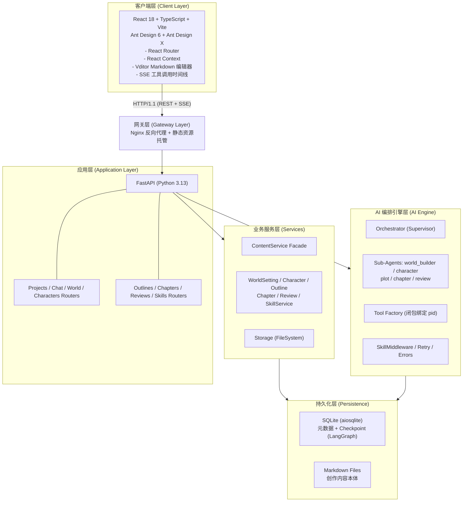
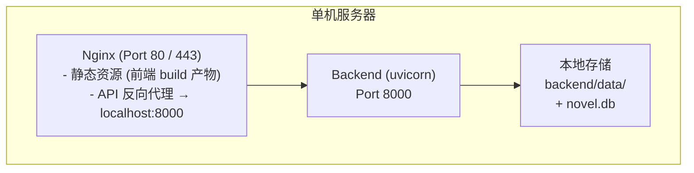
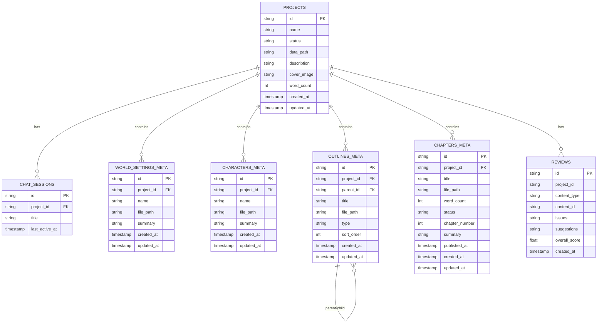
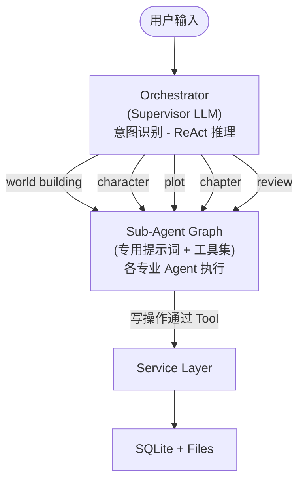

# 砚台：系统详细设计文档

**文档版本**: v1.0  
**编写日期**: 2026-05-10  

---

## 1. 引言

### 1.1 编写目的

本文档为「网络小说智能生成平台」的系统详细设计文档（SDD），在《软件需求规格说明书》的基础上，对系统架构、模块划分、数据模型、接口契约、关键算法与部署方案进行详细阐述，为开发实现与测试提供技术蓝图。

### 1.2 设计目标

1. **高内聚低耦合**：按业务领域划分前后端模块，AI 编排层与业务服务层解耦。
2. **项目级隔离**：任何数据访问与 AI 工具调用必须以 `project_id` 为边界，杜绝跨项目污染。
3. **流式实时性**：AI 生成过程需通过 SSE 实时推送到前端，提供类 ChatGPT 的交互体验。
4. **可观测与可恢复**：利用 LangGraph Checkpoint 实现会话状态持久化，支持异常中断后的无缝恢复。
5. **渐进式扩展**：LLM 供应商、子 Agent 类型、技能模板均需支持插件化扩展，不侵入核心代码。

---

## 2. 系统架构设计

### 2.1 总体架构图



### 2.2 技术栈矩阵

| 层级 | 技术选型 | 版本/说明 |
|------|----------|-----------|
| **前端框架** | React | 18.3+ |
| **前端语言** | TypeScript | 5.5+ |
| **构建工具** | Vite | 5.4+ |
| **UI 组件库** | Ant Design + Ant Design X | 6.x + 2.x |
| **前端路由** | React Router DOM | 6.26+ |
| **前端状态** | React Context | 无 Redux/Zustand |
| **Markdown 编辑** | Vditor | 3.11+ |
| **Markdown 渲染** | marked + DOMPurify + @ant-design/x-markdown | — |
| **后端框架** | FastAPI | 0.115+ |
| **后端语言** | Python | 3.13+ |
| **ASGI 服务器** | Uvicorn | 0.34+ |
| **配置管理** | Pydantic Settings | — |
| **包管理器** | uv | — |
| **LLM 框架** | LangChain + LangGraph | — |
| **LLM 供应商** | Anthropic (Claude) | 当前唯一支持 |
| **数据库** | SQLite + aiosqlite | WAL 模式 |
| **Checkpointer** | langgraph-checkpoint-sqlite (AsyncSqliteSaver) | 会话持久化 |
| **文件存储** | FileSystemStorage (自研) | 原子写入 + 路径安全 |
| **测试框架** | pytest + pytest-asyncio + pytest-cov | asyncio_mode=auto |
| **类型检查** | mypy | strict=true |
| **代码规范** | ruff | line-length=120 |
| **反向代理** | Nginx（可选） | 单机部署时可省略 |

### 2.3 部署架构（单机部署）



- **前端**：`npm run build` 生成 `dist/` 静态产物，由 Nginx 直接托管，无需独立服务进程。
- **后端**：Uvicorn 直接运行在宿主机上，监听 8000 端口，通过 systemd 或 supervisor 管理进程。
- **数据**：SQLite 数据库（`novel.db`）与 Markdown 文件（`backend/data/`）均存储在本地磁盘，单文件即可备份。
- **反向代理**：Nginx 负责静态资源服务与 API 反向代理，也可在简单场景下省略，由 Uvicorn 同时托管静态文件。
- **开发模式**：前端 `vite dev`（port 5173）通过 proxy 转发 `/api` 与 `/health` 到后端 `localhost:8000`。

---

## 3. 模块详细设计

### 3.1 前端模块设计

#### 3.1.1 目录结构

```
frontend/src/
├── main.tsx                    # 应用入口，挂载 ReactDOM.createRoot
├── App.tsx                     # 根组件：ConfigProvider + Router 定义
├── api/                        # API 客户端层
│   ├── client.ts               # Axios 实例（baseURL, headers）
│   ├── projects.ts
│   ├── world.ts
│   ├── characters.ts
│   ├── chapters.ts
│   ├── outlines.ts
│   ├── sessions.ts
│   └── activity.ts
├── contexts/                   # 全局状态（React Context）
│   ├── ProjectContext.tsx      # 当前项目上下文 + ProjectLoader
│   └── ChatContext.tsx         # 聊天上下文（封装 useProjectChat）
├── hooks/                      # 自定义 Hooks
│   └── useProjectChat.ts       # SSE 连接管理、消息解析、工具时间线构建
├── pages/                      # 页面级组件（按路由划分）
│   ├── Dashboard.tsx
│   ├── world/
│   │   ├── WorldList.tsx
│   │   └── WorldEdit.tsx
│   ├── characters/
│   ├── outline/
│   │   └── OutlineEditor.tsx
│   ├── chapters/
│   ├── chat/
│   │   └── ChatPage.tsx
│   └── settings/
├── components/                 # 可复用组件
│   ├── layout/
│   │   ├── IconSidebar.tsx     # 左侧图标导航（64px）
│   │   ├── SecondaryNav.tsx    # 二级导航（200px）
│   │   ├── AppLayout.tsx
│   │   └── DashboardLayout.tsx
│   ├── ai/
│   │   ├── ChatCore.tsx        # 核心聊天消息列表
│   │   └── DrawerChat.tsx      # 抽屉式聊天容器
│   ├── dashboard/
│   ├── cards/
│   └── common/
│       ├── MarkdownEditor.tsx  # Vditor 封装
│       ├── PageContainer.tsx
│       └── EmptyState.tsx
├── utils/                      # 工具函数
│   ├── format.ts               # 字数统计、日期格式化
│   └── frontmatter.ts          # gray-matter 封装
└── styles/                     # 全局样式与主题变量
    ├── theme.css
    └── vditor-override.css
```

#### 3.1.2 路由与布局矩阵

| 路径 | 页面组件 | 布局 | 上下文依赖 |
|------|----------|------|------------|
| `/` | Dashboard | DashboardLayout | — |
| `/projects/:id/world` | WorldList | AppLayout | ProjectContext |
| `/projects/:id/world/:worldId` | WorldEdit | AppLayout | ProjectContext |
| `/projects/:id/characters` | CharacterList | AppLayout | ProjectContext |
| `/projects/:id/characters/:charId` | CharacterEdit | AppLayout | ProjectContext |
| `/projects/:id/outline` | OutlineEditor | AppLayout | ProjectContext |
| `/projects/:id/chapters` | ChapterList | AppLayout | ProjectContext |
| `/projects/:id/chapters/:chapterId` | ChapterEdit | AppLayout | ProjectContext |
| `/projects/:id/chat` | ChatPage | AppLayout | ProjectContext + ChatContext |
| `/projects/:id/chat/:sessionId` | ChatPage | AppLayout | ProjectContext + ChatContext |
| `/projects/:id/settings` | ProjectSettings | AppLayout | ProjectContext |

#### 3.1.3 关键组件设计

**A. ChatCore 与 SSE 处理**
- `useProjectChat.ts` 管理原始 `fetch` 连接，解析 SSE 数据流。
- 消息状态机：`idle` → `connecting` → `streaming` → `complete` | `error`。
- 将 `on_tool_start` / `on_tool_end` 事件转换为时间线节点，按 `delegate` / `read` / `write` 分类渲染不同颜色的折叠面板。

**B. OutlineEditor**
- 基于 Ant Design `Tree` 组件实现，支持 `draggable` 拖拽排序。
- 节点数据与后端 `outlines_meta` 表一一对应，`parent_id` 表达层级关系。
- 节点选中后右侧加载对应 Markdown 文件内容供编辑。

**C. MarkdownEditor**
- 对 Vditor 的 React 封装，支持 `mode: 'sv'`（分屏编辑 + 实时预览）。
- 通过 `gray-matter` 解析/生成 YAML Frontmatter（用于角色、世界观等结构化文档）。

### 3.2 后端模块设计

#### 3.2.1 目录结构

```
backend/app/
├── main.py                     # FastAPI 工厂函数 create_app()， lifespan 管理
├── config.py                   # Pydantic Settings（.env 驱动）
├── api/v1/                     # REST API 路由层
│   ├── projects.py
│   ├── chat.py                 # SSE 流式端点
│   ├── world.py
│   ├── characters.py
│   ├── outlines.py
│   ├── chapters.py
│   ├── reviews.py
│   └── skills.py
├── core/                       # AI 编排与通用核心
│   ├── agent/
│   │   ├── langchain_subagents.py   # 5 个子 Agent 工厂
│   │   ├── tool_factory.py          # 项目级工具工厂（闭包绑定 pid）
│   │   └── skill_tools.py           # 运行时创建技能的工具
│   ├── graph/
│   │   ├── builder.py               # Orchestrator 图编译
│   │   └── state.py                 # OrchestratorState, ProjectContext
│   ├── prompts/                     # 系统提示词模板
│   ├── errors.py                    # AIError, ErrorCode, classify_llm_error
│   ├── retry.py                     # with_retry() 指数退避重试
│   └── logging_utils.py             # 结构化 JSON 日志
├── db/
│   ├── connection.py           # aiosqlite 连接管理（单例 + Lock）
│   ├── schema.sql              # 8 张表定义
│   └── checkpointer.py         # AsyncSqliteSaver 初始化与关闭
├── services/                   # 业务服务层
│   ├── content.py              # ContentService Facade
│   ├── base.py                 # BaseContentService（db + storage 注入）
│   ├── world.py
│   ├── character.py
│   ├── outline.py
│   ├── chapter.py
│   ├── review.py
│   ├── skill.py                # Skill 解析/CRUD
│   ├── storage.py              # ContentStorage Protocol + FileSystemStorage
│   ├── llm.py                  # create_llm_client() 工厂
│   ├── session_repository.py   # Chat Session 持久化
│   └── project_repository.py   # Project CRUD
└── models/                     # （预留，当前仅空 __init__.py）
```

#### 3.2.2 各层职责与交互规则

| 层级 | 职责 | 调用规则 |
|------|------|----------|
| **Router** | HTTP 请求校验、参数解析、响应封装 | 仅调用 Service 层，禁止直接访问 DB/文件 |
| **Service** | 业务逻辑编排、事务边界、数据转换 | 可调用 Repository/Storage/LLM，禁止直接引用 Agent |
| **Repository** | 数据库增删改查（原始 SQL + aiosqlite） | 仅被 Service 调用 |
| **Storage** | Markdown 文件的原子读写 | 仅被 Service 调用，内部做路径安全校验 |
| **Agent/Graph** | AI 编排、意图识别、子 Agent 调度 | 通过 Tool 调用 Service 完成写操作，禁止直接操作 DB/文件 |
| **Tool Factory** | 生成项目级工具（闭包绑定 `project_id`） | 被 Agent 层持有，工具内部调用 Service |

#### 3.2.3 AI 编排引擎详细设计

**A. Orchestrator（Supervisor）**
- 实现文件：`backend/app/core/graph/builder.py`
- 采用 `langchain.agents.create_agent` 构建顶层 ReAct Agent 图。
- 系统提示词要求 Orchestrator LLM 将用户意图分类为以下 5 类之一，并通过 handoff 工具委托：
  - `world_builder`：世界观、地理、文化、力量体系
  - `character`：角色档案、关系网、性格弧光
  - `plot`：情节、大纲、章节目录
  - `chapter`：正文撰写、润色、续写
  - `review`：质量审阅、一致性检查
- Handoff 通过返回 `Command(goto="<agent_name>", update={...})` 实现显式路由。

**B. Sub-Agents**
- 实现文件：`backend/app/core/agent/langchain_subagents.py`
- 每个子 Agent 是一个独立编译的 LangGraph 图，包含：
  1. 领域专属系统提示词（`backend/app/core/prompts/`）
  2. 项目级工具集（通过 `tool_factory.create_*_tools(project_id)` 生成）
  3. `SkillMiddleware`：在运行时将匹配 domain 的 Skill 注入系统提示词
- 子 Agent 类型：

| Agent | Domain | 核心工具 | 技能过滤标签 |
|-------|--------|----------|--------------|
| world_builder | world | create/edit/delete world, query/get content | `world` |
| character | character | create/edit/delete character, query/get content | `character` |
| plot | plot | create/edit/delete outline, get_outline_tree | `plot`, `outline` |
| chapter | chapter | create/edit/delete chapter, query/get content | `chapter` |
| review | review | create review, query/get content | `review` |

**C. Tool Factory 与隔离机制**
- 实现文件：`backend/app/core/agent/tool_factory.py`
- **关键约束**：工具绝不能为模块级单例。`create_tools(project_id)` 返回一组通过 Python 闭包绑定 `project_id` 的 `@tool` 函数。
- 写工具示例：`create_world_setting(project_id, name, content)` → 内部调用 `WorldSettingService.create(...)`。
- 读工具：`query_content(domain, query?)`、`get_content(domain, content_id)`、`get_outline_tree(outline_id?)` 为通用查询工具。

**D. State Schema**
- 定义文件：`backend/app/core/graph/state.py`
- `OrchestratorState`（TypedDict）：
  - `messages`: list[BaseMessage] — 对话历史
  - `session_id`: str — 会话标识
  - `project_id`: str — 项目标识
  - `project_context`: ProjectContext — 项目元数据摘要（非完整内容）
  - `pending_tool_calls`: list[dict] | None — 待处理工具调用（用于调试与可视化）
- `ProjectContext`：包含项目名称、描述、世界观摘要列表、角色摘要列表、大纲摘要、章节摘要。

**E. Retry & Error Handling**
- `classify_llm_error(exc)` 将 Anthropic 异常映射为 `AIError`（含 `error_code` + `retryable`）。
- `with_retry()` 实现指数退避 + 抖动，默认参数：`max_retries=3`, `base_delay=1.0s`。
- 不可重试错误（如 `BAD_REQUEST`, `AUTHENTICATION`）立即向上抛出，由 Router 层转换为 HTTP 502/503/504。

### 3.3 持久化层设计

#### 3.3.1 混合存储策略

| 数据类型 | 存储介质 | 理由 |
|----------|----------|------|
| 项目/会话/元数据 | SQLite (`novel.db`) | 结构化查询、事务、轻量 |
| 世界观正文 | Markdown 文件 (`data/{pid}/world/{id}.md`) | 大文本、版本控制友好、创作者可读 |
| 角色正文 | Markdown 文件 (`data/{pid}/characters/{id}.md`) | 同上 |
| 大纲节点正文 | Markdown 文件 (`data/{pid}/outlines/{id}.md`) | 同上 |
| 章节正文 | Markdown 文件 (`data/{pid}/chapters/{id}.md`) | 同上 |
| 审阅记录 | SQLite (`reviews` 表) | 结构化评分与问题列表 |
| 技能模板 | Markdown 文件 (`data/skills/{name}.md`) | 创作者可手动编辑、Git 友好 |
| LangGraph Checkpoint | SQLite（共享 `novel.db`） | 状态恢复、单文件备份 |

#### 3.3.2 文件存储安全设计
- `FileSystemStorage._resolve(project_id, relative_path)` 严格校验解析后的绝对路径位于 `DATA_DIR/{project_id}/` 之内。
- 写入采用原子操作：先写入临时文件，再 `os.rename()` 覆盖目标文件，避免半写状态。
- 读取使用 `aiofiles` 异步 IO，避免阻塞事件循环。

---

## 4. 数据库设计

### 4.1 E-R 关系图（逻辑模型）



### 4.2 物理表结构

详见 `backend/app/db/schema.sql`，核心字段如下：

**projects**
- `id TEXT PRIMARY KEY` — UUID
- `name TEXT NOT NULL`
- `status TEXT DEFAULT 'active'` — active / archived / deleted
- `data_path TEXT NOT NULL` — 项目数据目录
- `description TEXT`, `cover_image TEXT`, `word_count INTEGER DEFAULT 0`
- `created_at / updated_at TIMESTAMP`

**chat_sessions**
- `id TEXT PRIMARY KEY`
- `project_id TEXT REFERENCES projects(id)`
- `title TEXT`
- `last_active_at TIMESTAMP`

**world_settings_meta / characters_meta / outlines_meta / chapters_meta**
- 均包含：`id`, `project_id`, `name/title`, `file_path`, `summary/...`, `created_at`, `updated_at`
- `outlines_meta` 额外包含：`parent_id`（自反外键，支持嵌套树）、`type`（卷/章/节）、`sort_order`
- `chapters_meta` 额外包含：`word_count`, `status`（draft/published）, `chapter_number`, `published_at`

**reviews**
- `id TEXT PRIMARY KEY`
- `project_id`, `content_type`（world/character/outline/chapter）, `content_id`
- `issues TEXT`（JSON 或 Markdown 列表）, `suggestions TEXT`, `overall_score REAL`

---

## 5. 接口设计

### 5.1 REST API 概览

所有业务 API 以 `/api/v1` 为前缀。内容资源统一采用 `POST /{id}/update` 与 `POST /{id}/delete`（非 PATCH/DELETE），保持风格一致。

| 资源 | 端点 | 方法 | 说明 |
|------|------|------|------|
| Health | `/health` | GET | 健康检查 |
| Projects | `/projects` | POST | 创建项目 |
| | `/projects` | GET | 列出项目 |
| | `/projects/{id}` | GET | 获取项目详情 |
| | `/projects/{id}` | PATCH | 更新项目 |
| | `/projects/{id}` | DELETE | 删除项目 |
| Chat Sessions | `/projects/{pid}/sessions` | POST | 创建会话 |
| | `/projects/{pid}/sessions` | GET | 列出会话 |
| | `/projects/{pid}/sessions/{sid}` | DELETE | 删除会话 |
| | `/projects/{pid}/sessions/{sid}/history` | GET | 获取会话历史 |
| Chat Stream | `/projects/{pid}/sessions/{sid}/chat/stream` | POST | SSE 流式对话 |
| World | `/projects/{pid}/world` | POST | 创建设定 |
| | `/projects/{pid}/world` | GET | 列出设定 |
| | `/projects/{pid}/world/{wid}` | GET | 获取设定 |
| | `/projects/{pid}/world/{wid}/update` | POST | 更新设定 |
| | `/projects/{pid}/world/{wid}/delete` | POST | 删除设定 |
| Characters | `/projects/{pid}/characters` | POST / GET | 创建 / 列出角色 |
| | `/projects/{pid}/characters/{cid}` | GET | 获取角色 |
| | `/projects/{pid}/characters/{cid}/update` | POST | 更新角色 |
| | `/projects/{pid}/characters/{cid}/delete` | POST | 删除角色 |
| Outlines | `/projects/{pid}/outlines` | POST / GET | 创建 / 列出大纲 |
| | `/projects/{pid}/outlines/{oid}` | GET | 获取大纲节点 |
| | `/projects/{pid}/outlines/{oid}/update` | POST | 更新大纲 |
| | `/projects/{pid}/outlines/{oid}/delete` | POST | 删除大纲 |
| Chapters | `/projects/{pid}/chapters` | POST / GET | 创建 / 列出章节 |
| | `/projects/{pid}/chapters/{cid}` | GET | 获取章节 |
| | `/projects/{pid}/chapters/{cid}/update` | POST | 更新章节 |
| | `/projects/{pid}/chapters/{cid}/delete` | POST | 删除章节 |
| Reviews | `/projects/{pid}/reviews` | POST / GET | 创建 / 列出审阅 |
| | `/projects/{pid}/reviews/{rid}` | GET | 获取审阅详情 |
| Skills | `/skills` | GET / POST | 列出 / 创建技能 |
| | `/skills/{name}` | GET | 获取技能详情 |
| | `/skills/{name}/update` | POST | 更新技能 |
| | `/skills/{name}/delete` | POST | 删除技能 |

### 5.2 SSE 流式对话接口

**端点**：`POST /api/v1/projects/{project_id}/sessions/{session_id}/chat/stream`

**请求体**：
```json
{
  "message": "帮我生成主角的详细性格设定",
  "options": {
    "temperature": 0.7
  }
}
```

**响应**：`Content-Type: text/event-stream`

事件类型与数据格式：

| Event Type | 说明 | 示例数据结构 |
|------------|------|--------------|
| `message` | LLM 生成的文本流（token 级） | `{"type":"message","content":"他性格","delta":true}` |
| `tool_start` | Agent/工具开始执行 | `{"type":"tool_start","tool":"delegate_to_character","input":{...}}` |
| `tool_end` | Agent/工具执行结束 | `{"type":"tool_end","tool":"delegate_to_character","output":"..."}` |
| `thinking` | 推理内容流（Claude thinking 模式） | `{"type":"thinking","content":"..."}` |
| `error` | 执行过程中发生的错误 | `{"type":"error","code":"RATE_LIMIT","message":"..."}` |
| `complete` | 整个生成流程结束 | `{"type":"complete","session_id":"..."}` |

**状态码**：
- `200`：SSE 流正常建立
- `403`：Session 不属于该 Project
- `404`：Session 不存在
- `502/503/504`：LLM 服务不可用或超时

### 5.3 核心数据模型（Pydantic / JSON Schema）

**ProjectBase**
```json
{
  "id": "string",
  "name": "string",
  "status": "active",
  "description": "string | null",
  "cover_image": "string | null",
  "word_count": 0,
  "created_at": "ISO8601",
  "updated_at": "ISO8601"
}
```

**ChatMessage**
```json
{
  "role": "user | assistant | tool",
  "content": "string",
  "tool_calls": [...],
  "timestamp": "ISO8601"
}
```

**ReviewResult**
```json
{
  "id": "string",
  "content_type": "world | character | outline | chapter",
  "content_id": "string",
  "issues": "string (Markdown list)",
  "suggestions": "string (Markdown list)",
  "overall_score": "float (0.0 ~ 10.0)",
  "created_at": "ISO8601"
}
```

**SkillTemplate**
```yaml
---
name: "黄金三章写作法"
domain: ["chapter", "plot"]
description: "指导开篇三章的钩子设计"
---
# 提示词正文...
```

---

## 6. 关键算法与流程

### 6.1 多智能体协作流程



**意图识别机制**：
1. Orchestrator 的系统提示词中定义了 5 个 handoff 工具（`delegate_to_*`）。
2. LLM 根据用户输入选择最合适的一个 handoff 工具调用，传入用户原始消息。
3. Handoff 工具返回 `Command(goto="<agent>", update={"messages": [...]})`，LangGraph 将控制权转交子 Agent。
4. 子 Agent 独立执行其 ReAct 循环，可多次调用读写工具，最终返回结果消息。
5. 子 Agent 完成后，图状态回到 Orchestrator（或结束）。

### 6.2 项目上下文加载流程

为避免 Orchestrator 与 Sub-Agent 的上下文窗口被海量正文撑爆，系统采用**元数据摘要注入**策略：

1. **启动时**：`builder.py` 根据 `project_id` 从 `ProjectContextService` 加载摘要：
   - 项目基本信息（名称、描述）
   - 世界观列表（仅名称 + 摘要）
   - 角色列表（仅名称 + 身份摘要）
   - 大纲树结构（仅标题层级）
   - 章节列表（仅标题 + 状态）
2. **Agent 需要详情时**：通过 `get_content` / `query_content` 工具按需读取完整 Markdown 内容，而非一次性加载。
3. **状态更新**：当 Sub-Agent 执行写操作后，`ProjectContext` 中的对应摘要条目被同步更新，确保后续 Agent 轮次看到最新元数据。

### 6.3 流式事件处理流程（v2 Streaming）

后端采用 LangGraph v2 streaming API：
```python
async for event in graph.astream(
    input_state,
    config,
    stream_mode=["messages", "updates", "custom"],
    subgraphs=True,
    version="v2"
):
    # event 类型判定
    # - on_chat_model_stream → 文本/thinking token
    # - on_tool_start / on_tool_end → 工具调用时间线
    # - on_chain_end → 子图完成
    yield f"event: message\ndata: {json.dumps(payload)}\n\n"
```

前端 `useProjectChat.ts` 维护一个 `EventParser`：
1. 接收 SSE chunk，按 `\n\n` 分割为事件帧。
2. 根据 `event:` 类型路由到对应处理器，更新 React 状态：
   - `message` → 追加到当前 assistant 消息内容
   - `tool_start` → 在时间线数组中插入 pending 节点
   - `tool_end` → 将 pending 节点标记为完成，填充结果
   - `error` → 终止流并显示错误横幅
   - `complete` → 将消息状态设为 `complete`，关闭 EventSource

### 6.4 历史消息截断策略

为防止 LangGraph 状态膨胀导致上下文窗口溢出：
1. **Token 预算截断**：使用 `trim_messages` 按 Token 数裁剪历史，保留最近 N 轮对话 + 系统提示词。
2. **消息数兜底**：当 Token 估算不可用时，按消息条数上限（如 20 条）进行硬截断。
3. **Checkpoint 清理**：长期不活跃的会话，其早期 checkpoint 可定期归档或删除（当前实现保留全部，未来可扩展）。

---

## 7. 安全设计

### 7.1 访问控制

| 威胁 | 防护措施 |
|------|----------|
| 跨项目数据访问 | Router 层校验资源 `project_id` 与 URL `project_id` 是否一致；Session 校验 `verify_project_binding()` |
| 路径遍历攻击 | `FileSystemStorage._resolve()` 严格校验绝对路径前缀；禁止 `..` 与绝对路径注入 |
| LLM API Key 泄露 | 仅通过环境变量 `ANTHROPIC_API_KEY` 注入，不落入日志与数据库 |
| CORS 滥用 | 显式配置 `allow_origins`，生产环境仅允许已知域名 |

### 7.2 输入校验

- FastAPI 依赖 Pydantic 模型进行请求体校验。
- Markdown 内容不直接渲染为 HTML（前端使用 DOMPurify + marked 安全渲染）。
- 文件名/路径中的非法字符在 Storage 层被过滤或转义。

### 7.3 错误处理与信息隐藏

- 生产环境不返回 Python 异常堆栈，仅返回标准化错误码与友好提示。
- `AIError` 映射表：

| LLM 异常 | 错误码 | HTTP 状态 | 是否重试 |
|----------|--------|-----------|----------|
| RateLimitError | `RATE_LIMIT` | 503 | 是 |
| APITimeoutError | `TIMEOUT` | 504 | 是 |
| APIConnectionError | `NETWORK_ERROR` | 502 | 是 |
| AuthenticationError | `AUTHENTICATION` | 401 | 否 |
| BadRequestError | `BAD_REQUEST` | 400 | 否 |
| ContextWindowExceeded | `CONTEXT_WINDOW_EXCEEDED` | 413 | 否 |

---

## 8. 部署与运维设计

### 8.1 单机部署方案

系统采用单机部署，前端构建产物与后端服务均运行在同一台服务器上，无需容器化编排。

**环境准备**
```bash
# Python 3.13+ 与 uv
curl -LsSf https://astral.sh/uv/install.sh | sh
# Node.js 20+ (用于前端构建)
# Nginx (可选，用于反向代理)
```

**后端部署**
```bash
cd backend
uv sync                                    # 安装依赖
cp .env.example .env                        # 配置 ANTHROPIC_API_KEY 等环境变量
uv run uvicorn app.main:app --host 0.0.0.0 --port 8000
```
生产环境建议使用 systemd 管理后端进程：
```ini
# /etc/systemd/system/novel-backend.service
[Unit]
Description=Novel Generation Backend
After=network.target

[Service]
WorkingDirectory=/opt/IterationTwoTask1/backend
ExecStart=/opt/IterationTwoTask1/backend/.venv/bin/uvicorn app.main:app --host 0.0.0.0 --port 8000
Restart=always
EnvironmentFile=/opt/IterationTwoTask1/backend/.env

[Install]
WantedBy=multi-user.target
```

**前端部署**
```bash
cd frontend
npm install
npm run build                              # 生成 dist/ 静态产物
# 将 dist/ 目录复制到 Nginx 托管目录，或由后端直接托管静态文件
```

**Nginx 配置**（可选）
```nginx
server {
    listen 80;
    server_name your-domain.com;

    # 前端静态资源
    location / {
        root /opt/IterationTwoTask1/frontend/dist;
        try_files $uri $uri/ /index.html;
    }

    # API 反向代理
    location /api/ {
        proxy_pass http://127.0.0.1:8000;
        proxy_set_header Host $host;
        proxy_set_header X-Real-IP $remote_addr;
    }

    # SSE 长连接需要关闭缓冲
    location /api/v1/projects/ {
        proxy_pass http://127.0.0.1:8000;
        proxy_buffering off;
        proxy_cache off;
        proxy_set_header Connection '';
        proxy_http_version 1.1;
        chunked_transfer_encoding off;
    }
}
```

### 8.2 监控与日志

- **结构化日志**：所有 AI 相关操作输出 JSON 日志，包含 `timestamp`, `level`, `event_type`, `project_id`, `session_id`, `error_code`, `retry_count`。
- **健康探针**：`/health` 返回 `{"status": "healthy"}`，可用于监控脚本或负载均衡器存活检测。
- **未来扩展**：引入 LangSmith 进行 Agent 链路追踪；引入 Prometheus/Grafana 进行 API 性能监控。

### 8.3 备份与恢复

- **SQLite**：单文件备份，可直接 `cp novel.db novel.db.backup`。
- **Markdown 文件**：`backend/data/` 目录整体备份，兼容 Git 版本控制。
- **建议策略**：每日定时快照 `novel.db` + `data/` 目录到对象存储或异地磁盘。

### 8.4 Docker 部署（预留）

当前版本暂不提供 Docker 部署支持，后续可基于现有架构补充容器化方案。

---

## 9. 附录

### 9.1 核心文件索引

| 文件路径 | 说明 |
|----------|------|
| `backend/app/main.py` | FastAPI 应用工厂 |
| `backend/app/core/graph/builder.py` | Orchestrator 图构建 |
| `backend/app/core/graph/state.py` | 状态定义 |
| `backend/app/core/agent/tool_factory.py` | 项目级工具工厂 |
| `backend/app/core/agent/langchain_subagents.py` | 子 Agent 工厂 |
| `backend/app/services/content.py` | ContentService Facade |
| `backend/app/services/storage.py` | 文件存储协议与实现 |
| `backend/app/db/schema.sql` | 数据库 Schema |
| `frontend/src/App.tsx` | 前端路由与主题配置 |
| `frontend/src/hooks/useProjectChat.ts` | SSE 聊天逻辑 |

### 9.2 设计决策记录（ADR）

| 决策 | 选项 | 选中方案 | 理由 |
|------|------|----------|------|
| 前端框架 | Vue 3 / React | React 18 + TS | 生态丰富，Ant Design X 专为 React AI 聊天设计 |
| 状态管理 | Redux / Zustand / Context | React Context | 项目规模适中，Context 足够且减少依赖 |
| ORM | SQLAlchemy / 原始 SQL | 原始 SQL + aiosqlite | 模型简单，避免 ORM 开销；LangGraph checkpointer 也直接用 SQLite |
| 内容存储 | DB BLOB / 文件系统 | Markdown 文件 | 创作者可直接读写，Git 友好，避免大字段拖慢 DB |
| LLM 供应商 | OpenAI / Anthropic / 本地 | Anthropic Claude | 当前唯一支持，代码预留工厂扩展点 |
| 流式协议 | WebSocket / SSE | SSE | 单向推送足够，SSE 更易穿透防火墙与代理 |
