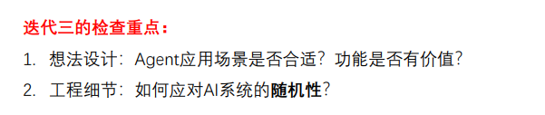
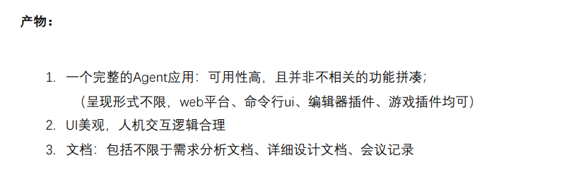
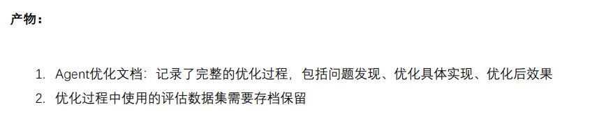

# 迭代三想法收集

## Agent 产品化

亮点扩展：没有具体要求，根据Agent应⽤所在领域实现亮点业务功能 整个的迭代三重点！！！

### P0（必做）

1. Skill（已完成：蒋程浚）
- 前端提供 **Skill 市场/管理界面**，用户可浏览、启用/禁用已注册的 Skill（如“玄幻世界观生成器”、“对话润色助手”、“卡文急救模式”）。
- 支持 **自定义 Skill 输入输出模板**：用户通过简单的 DSL 或 UI 配置，将特定的提示词、工具调用封装成个性化 Skill。
- 对话中通过 `/skill` 命令快速调用，例如 `/skill 生成人物卡 角色名=李逍遥`。
- Skill 运行时可展示中间步骤（如“正在检索武侠招式库…”），增强透明感。

2. 跨对话知识共享（已完成：王泰杰）
- 构建 **项目级知识库**：用户创建一部小说后，系统自动维护该小说的**全局状态**（世界观设定、人物列表、时间线、已埋伏笔、已回收伏笔、章节梗概）。
- 跨对话引用机制：新建对话时，允许用户选择关联已有小说项目，Agent 自动加载该项目的知识库摘要（可配置加载深度）。
- 提供 **知识冲突检测**：当新对话中的内容与知识库记录矛盾时（例如修改了某角色的死亡时间），主动询问用户是否更新知识库。
- 实现 **知识增量更新**：每个对话结束后，让用户确认哪些新信息需要写入全局知识库（如新增配角、调整势力关系）。

3. 前端的凭据（API key）管理与配置（已完成：蒋程浚）
- 支持多套凭据配置（主 LLM API、备用 LLM、搜索 API、图像生成 API 等），用户可分别填入。
- 提供 **用量统计与配额预警**：展示当前周期内各 API 的调用次数、预估费用，达到阈值时弹窗提醒。
- 支持 **运行时切换**：在某次生成失败或用户主动要求时，一键切换到备用模型。
- 安全性增强：前端存储仅保存加密后的 Key 指纹，真实 Key 通过后端代理使用，避免暴露。

### P1（高优先级）

1. HITP（Human in the loop）
- **大纲审核节点**：Agent 生成全本大纲（卷/章标题及核心情节）后，暂停等待用户批注修改，确认后再进入逐章写作。
- **关键选择点注入**：在剧情分支处（例如主角面临道德抉择），Agent 生成 2~3 个候选项，用户点击选择后继续。
- **实时干预**：用户可在对话中打断 Agent 的生成，直接编辑已输出的部分，Agent 基于编辑后的内容重新规划后续。
- **人工评分反馈**：每章生成后，用户可给予 1~5 星评分及文字反馈，用于后续个性化优化。

### P2（选做）

1. Guardrails（输入护栏，输出护栏，行为与执行护栏，主题与业务边界）
- **输入护栏**：检测用户指令是否包含敏感人物、色情暴力或脱离小说主题的内容（如插入现实政治），若触发则友好拒答并引导。
- **输出护栏**：自动扫描生成的章节是否含有违禁词、过度血腥/色情描写，进行脱敏或重写。
- **行为护栏**：限制 Agent 在一次对话中主动调用外部工具（如搜索、修改知识库）的次数，防止失控。
- **主题边界护栏**：基于用户预先设定的“小说类型”（如仙侠、都市、科幻），检测生成内容是否偏离核心流派特征（例如在硬科幻中出现魔法），并提示修正。

2. UX优化：agent可以通过某种方式在对话中展示某个具体的文档的内容
- 在对话流中，Agent 可渲染 **可折叠/嵌入的文档卡片**，展示完整的人物设定表、章节预览、伏笔列表等。
- 支持 **双栏视图**：右侧固定显示当前小说项目的“设定档案”，Agent 在左侧对话中提及某角色时，右侧高亮对应条目。
- 生成的长篇章可展示为 **分页/滚动区域**，并支持评论锚点（用户可针对某一段落发表意见）。

3. MCP
- 实现 **轻量级插件通信协议**，允许 Agent 与外部写作辅助工具（如思维导图工具、词云生成器）通过标准化消息交换数据。例如：Agent 生成情节脉络后，一键发送到 XMind 生成脑图。

4. 联网搜索（真的很贵，调一次三分钱）
- 提供 **仅手动触发** 的搜索开关，默认关闭，用户需明确开启。
- 搜索场景限定：查询历史朝代服饰、地理名称、神话生物等写作素材，禁止用于生成正文。
- 搜索结果自动 **缓存 24 小时**，相同查询不重复扣费。
- 增加费用二次确认弹窗：“本次搜索预计消耗 0.03 元，是否继续？”

5. UX优化：新手引导 & 一键复制/导出
- **新手引导**：
  - 首次进入时提供 **分步向导**：创建小说 → 设定世界观 → 生成大纲 → 试写第一章。
  - 关键功能处内嵌 **Tooltip 视频教程**（时长 <30 秒）。
- **一键复制/导出**：
  - 任何生成的文本（单段/整章/整书）旁添加复制按钮，自动带格式（Markdown 或纯文本）。
  - 导出格式支持：**TXT、Markdown、EPUB（需后端转）、PDF**，并可选择是否包含设定集附录。

## Agent 能力优化

亮点扩展：从评估平台的指标结果或者⼀些具体的Bad Case出发，对Agent应⽤的效果进⾏优化

### P0（必做）

1. 多轮对话支持（已完成）
- 无需补充。

2. 自有数据集的构建（已完成：王泰杰）
- 构建 **小说情节连贯性评估数据集**：覆盖 8 种网文类型（仙侠、都市、西方奇幻、玄幻、历史、科幻、悬疑推理、轻小说游戏），共 520 条样本，含 12 种情节错误类型标注。
- 构建 **角色一致性检测数据集**：覆盖 8 种网文类型，23 个角色档案（每个含 10 条台词/行为，共 230 条），附加 50 条独立负面样例。错误类型从 5 类扩展至 10 类。
- 构建 **伏笔回收检测数据集**：覆盖 8 种网文类型，共 370 条伏笔-回收配对样本（含新生成的 295 条 + 原始 75 条种子），错误类型从 5 类扩展至 10 类。
- 三个数据集总计约 1180 条样本单元，格式兼容迭代二评估平台，可直接导入进行自动化评估。

3. Multi-Agent（已完成）
- 无需补充。

4. 上下文工程：对话历史（滑动窗口 / Compact）（已完成：王泰杰）
- **滑动窗口**：默认保留最近 8 轮对话（约 6k token），超出部分自动摘要并压缩成”前情提要”置入系统消息。
  - 实现方式：`COMPRESSION_MESSAGE_THRESHOLD = 20` 条消息触发压缩，`RECENT_MESSAGES_TO_KEEP = 6`（约 3 轮对话）。
  - 压缩后的摘要以 `SystemMessage` 注入消息列表头部，后续仍通过 `trim_messages` 做 token 安全截断。
- **分层压缩**：
  - 第一层：完整保留最近 3 轮原始对话（约 6 条消息）。
  - 第二层：对更早的对话使用 LLM 生成结构化 JSON 摘要，包含四个字段：`events`（事件）、`settings_changes`（设定变更）、`pending_todos`（待办）、`continuity_updates`（连续性信息对）。
  - 支持 **增量合并**：已有摘要与新对话合并，避免重复压缩全部历史。
- **对话后异步压缩**：每次对话结束后异步将本轮内容压缩并合并到持久化摘要中，不影响对话主流程。
- **小说专用压缩策略**：
  - **正文保留**：保留最近 2 章完整正文，确保 Agent 写作时能看到即时上下文。
  - **伏笔追踪**：所有未回收伏笔列表始终保留，保障伏笔的跨章节连贯性。
  - **主角状态**：主角当前修为、位置、重要状态变化等关键信息持续维护。
  - **Token 安全截断**：通过 `trim_messages` 控制总 Token 数不超过预设上限（默认 12K tokens）。
- **关键信息提取**：从对话中提取结构化关键信息（用户偏好、设定变更、待办事项），以简洁的键值对形式持久化，比全文摘要更节省 Token。
- **选择性检索（RAG 辅助）**：对远期对话执行向量化存储，需要时通过语义相似性检索最相关的历史片段注入提示词，避免携带全部历史。

### P1（高优先级）

1. 架构优化：Plan-and-Execute 模式及高级模式
- **章节级 Plan-and-Execute**：
    - Plan 阶段：Agent 根据当前大纲和目标字数，生成本章节的 **分段计划**（每段 200~300 字，包含核心冲突、对话点、环境描写）。
    - Execute 阶段：逐段生成，每生成一段后检查是否偏离计划，若偏离则微调后续计划。
- **弧光规划模式**：预先规划主角在整本小说中的“能力成长曲线”和“心路历程变化点”，生成正文时自动对齐这些里程碑。
- **纠错重规划**：当模型输出质量低于阈值（由小型质量评估模型判定），自动回退到规划步骤，调整计划后重新执行。

2. 工具链优化：工具描述、扩展、容错（部分完成：王泰杰）
- **工具描述增强**：为每个工具（如”查角色信息”、”计算修为等级”、”生成地名”）提供自然语言别名，LLM 可通过语义匹配调用，例如”看看李逍遥的师父是谁”触发”查角色信息”工具。
- **工具扩展**：
    - 新增 **伏笔管理工具**：记录伏笔位置、预期回收章节。（已完成：王泰杰）
    - 新增 **时间线冲突检测工具**：输入事件 A 和事件 B，判断时间顺序是否矛盾。（已完成：王泰杰）
- **容错机制**：
    - **前置校验**：调用”生成地名”工具前，先检查输入参数（如”风格=西方魔幻”是否与当前仙侠世界观冲突），若冲突则自动修正参数或询问用户。（已完成：王泰杰）
    - **降级处理**：当主 LLM 超时或返回格式错误时，切换至更轻量的模型执行基础任务（如仅生成对话），并在响应中告知用户已降级。（已完成：王泰杰）

3. 记忆管理
- **短期记忆（工作记忆）**：存储当前对话中提及的临时信息（如“用户刚才说希望主角更果断”），对话结束后可丢弃。
- **长期记忆**：
    - **角色记忆**：每个角色的性格、说话风格、人际关系，以向量库存储，检索时根据角色名召回。
    - **剧情记忆**：已写章节的摘要向量，用于在生成新章节时检索相似情节避免重复。
- **记忆整合与遗忘**：每完成 10 章后，运行一次“记忆整理Agent”，将零散设定合并、删除冗余信息，并生成记忆报告供用户确认。

### P2（选做）

1. RAG（检索增强生成）
- **素材库 RAG**：收集 1000+ 本优秀网文的经典片段（打标：场景类型、情绪标签、写作手法），在用户需要“写一场战斗”时，检索相似优秀描写作为参考但不直接复制。
- **设定库 RAG**：对用户自己构建的世界观文档（如“丹药体系”、“武学阶位”）建立索引，生成正文时自动检索相关设定并融入，避免设定冲突。
- **用户反馈 RAG**：记录用户过去对 Agent 输出的修改记录（改了什么、从什么改成什么），构建个性化编辑偏好库，后续生成时优先采纳相似风格。

## 其它

### P1（高优先级）

1. 角色一致性审查器
- 在每章生成后，自动调用一个轻量模型（或规则+向量比较）检查角色的言行是否与设定库中的“角色卡”匹配。输出不一致之处供用户确认或自动修正。

2. 自动标注潜在伏笔（已完成：王泰杰）
- 在用户写作（或 Agent 生成）过程中，识别出看似不经意的描写（如”主角在洞穴里捡到了一块不起眼的石头”），自动提示”是否标记为伏笔？”，并记录位置。

### P2（选做）

1. 写作数据看板
- 展示每日/每周写作字数、对话轮数、修改频次、常用 Skill 排名、模型成本等指标，帮助用户了解自己的创作习惯。

2. 多模态扩展
- 根据小说章节内容，自动生成 **概念图**（如人物关系图、势力地图）或调用图像生成模型绘制关键场景插画（需用户配置图像生成 API Key）。